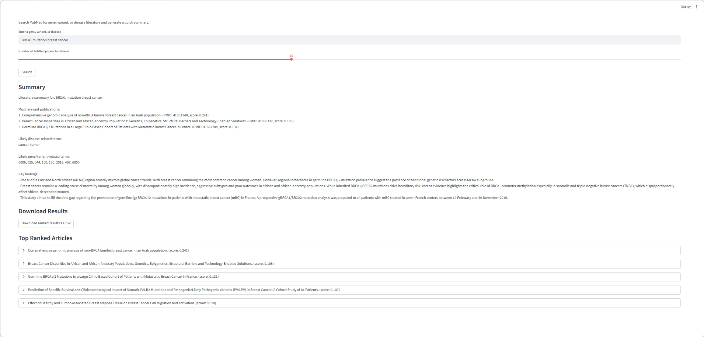

# Clinical Variant Literature Summarizer

A lightweight biomedical NLP project for retrieving, ranking, summarizing, and structuring PubMed literature relevant to genes, variants, and disease-associated queries.

## Overview

This project helps users explore biomedical literature for variant interpretation by:
- querying PubMed for gene, variant, or disease terms
- retrieving article titles and abstracts
- ranking articles by relevance using TF-IDF and cosine similarity
- generating concise literature summaries
- extracting likely disease-related and gene-like terms
- exporting ranked results as CSV

## Features

- PubMed search via NCBI E-utilities
- Relevance ranking with scikit-learn
- Rule-based biomedical term extraction
- Streamlit web interface
- CSV export of ranked literature results
- Clickable PubMed links

## Tech Stack

- Python
- requests
- scikit-learn
- pandas
- Streamlit

## Example Queries

- BRCA1 mutation breast cancer
- TP53 mutation
- SCN2A epilepsy
- familial glioma
- DMD Duchenne variant

## Run Locally

```bash
python -m pip install -r requirements.txt
python -m streamlit run app.py


## Screenshots

### Summary and Results View


